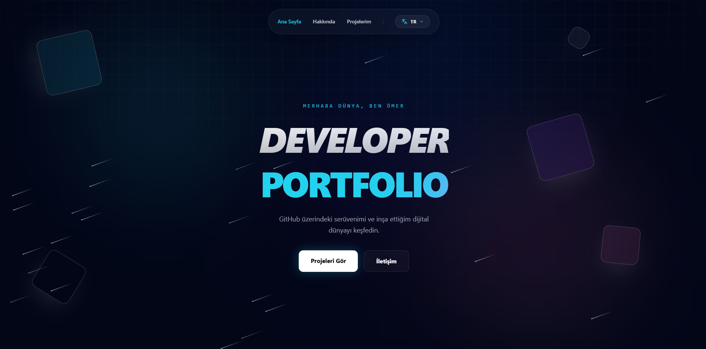
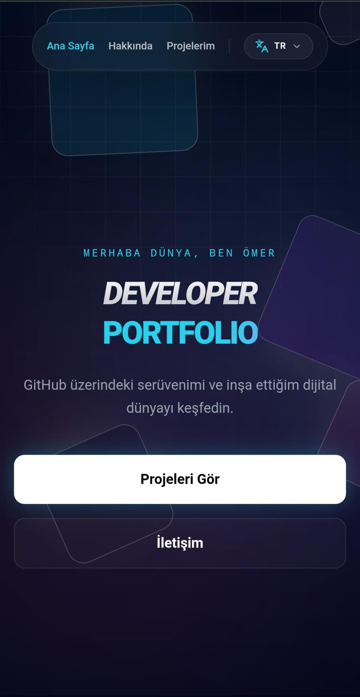
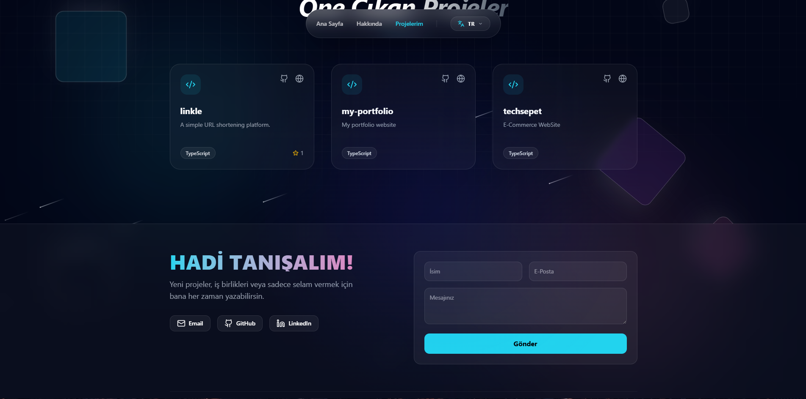
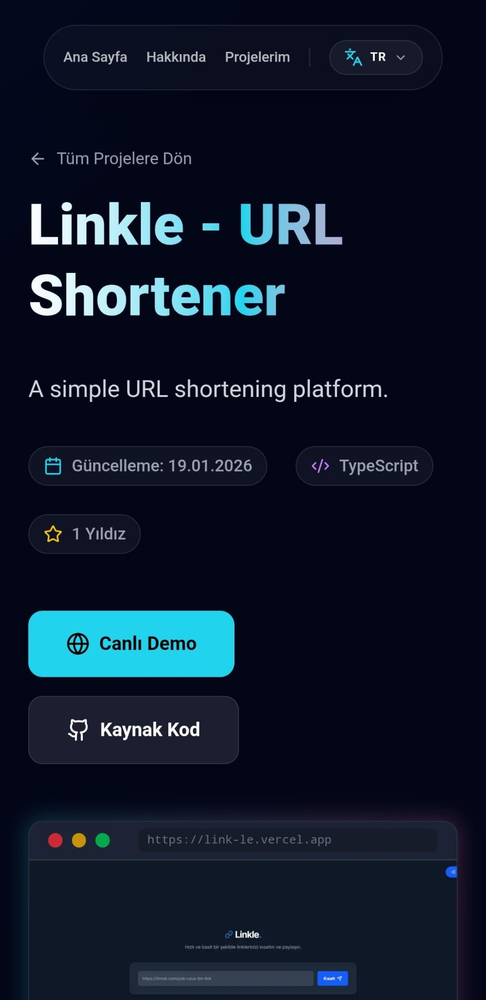

## 🚀 Modern & Innovative Developer Portfolio
This is a high-performance, SEO-optimized personal portfolio built with the latest web technologies to showcase my engineering projects and technical skills.

🚀 **[View Live Demo](https://omersengul.vercel.app)**

---

## 📸 Screenshots

| Desktop View | Mobile Responsiveness |
| :---: | :---: |
| | |
| |	|

---

## ✨ Features

🌍 Internationalization (i18n): Full multi-language support (TR/EN) using next-intl for a global reach.

🔄 Dynamic Project Data: Real-time project fetching and statistics integration via GitHub API.

🎨 Premium UI/UX: Modern Glassmorphism design with Bento Grid layout and smooth animations powered by Framer Motion.

⚡ Server-Side Excellence: Optimized using Next.js 15 Server Components and Streaming for maximum performance.

📱 Adaptive Design: Fully responsive architecture ensuring a flawless experience on all devices.

📬 Interactive Contact: Integrated contact section for seamless professional networking.

---

## 🛠️ Tech Stack

-Frontend: Next.js 15 (App Router), React 19, Tailwind CSS, Framer Motion
-Internationalization: Next-intl
-Icons & Assets: Lucide React, SVG Icons
-Language: TypeScript
-Deployment: Vercel
-API: GitHub REST API

## ⚙️ Installation

1-Clone the repository:
git clone https://github.com/omersengull/my-portfolio.git

2-Install dependencies:
bun install  # or npm install

3-Set up environment variables: Create a .env.local file and add your GitHub token if needed for higher rate limits.

4-Run the development server:
bun dev

## 📄 License

This project is licensed under the MIT License.
